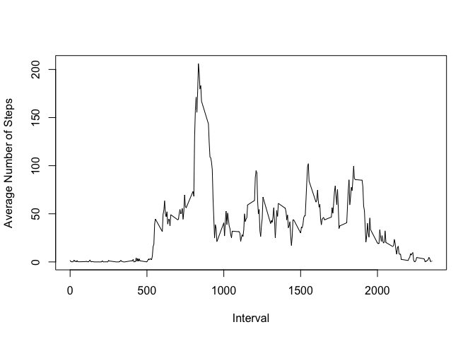
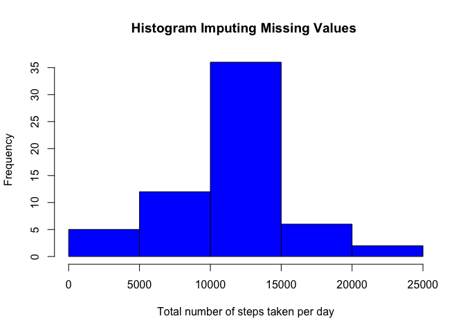

# Reproducible Research: Peer Assessment 1


## Loading and preprocessing the data

```r
options(scipen = 1, digits = 5)
# Checking the zip file is already there 
if (!file.exists("activity.zip")) {
download.file(url = "https://d396qusza40orc.cloudfront.net/repdata%2Fdata%2Factivity.zip",
method = "curl", destfile = "activity.zip", quiet = TRUE)
}
# Unzipping the zip file
unzip(zipfile = "activity.zip", exdir = "./")
# Reading the csv file
data <- read.csv("./activity.csv",header = TRUE)
```


## What is mean total number of steps taken per day?


```r
library(plyr)
datanoNA <- na.omit(data)
stepsPerDay <- ddply(datanoNA,~date,summarise,sum(steps))
hist(stepsPerDay[,2],col= "blue", xlab ="Total number of steps taken per day",main = " ")
```

 

```r
meanStepsPerDay <- mean(stepsPerDay[,2])
medianStepsPerDay <- median(stepsPerDay[,2])
```

- The mean total number of steps taken per day is 10766.18868.
- The median total number of steps taken per day is 10765.

## What is the average daily activity pattern?

```r
stepsPerInterval <- ddply(datanoNA,~interval,summarise,mean(steps))
plot(stepsPerInterval[,1],stepsPerInterval[,2],type='l',ylab="Average Number of Steps",xlab="Interval")
```

 

```r
max <- max(stepsPerInterval[,2])
maximum <- stepsPerInterval[which(stepsPerInterval[,2]==max),]
stepsPerIntervalwithNA <- ddply(datanoNA,~interval,summarise,mean(steps))
sumStepswithNA <- sum(is.na(stepsPerIntervalwithNA))
```


The 5-minute interval number 835, on average across all the days in the dataset, contains the maximum number of daily average steps 206.16981.

## Imputing missing values


```r
# Checking missing values
sumNA <- sum(is.na(data))
```

We have in our data 2304 missing values.

Our algorithm for filling in the missing values in the dataset will replace the missing values by the average of the corresponding 5-minute interval . We follow the next steps:
        
- Find the mean value of steps for each 5-minute interval removing missing values (we already did this in previous step)
- Replace the missing value of each 5-minute interval by the corresponding mean value. 
        

```r
dataImputingNA <- data
# Putting together the original dataset with the corresponding average in a new dataframe
dataImputingNA <-  data.frame(data,stepsPerInterval)
# Replacing the NA by the corresponding average 5-minute interval and putting in a new column 
dataImputingNA$steps2 <- ifelse(is.na(dataImputingNA[,1]),dataImputingNA[,5],dataImputingNA[,1])
# Creating a new dataset that is equal to the original but with the missing data filled in
dataImputingNA <-  within(dataImputingNA,rm(steps,interval.1,..1))
names(dataImputingNA) <- c("date","interval","steps")
dataImputingNA <- dataImputingNA[c("steps","date","interval")]
```


```r
stepsPerDayImp <- ddply(dataImputingNA,~date,summarise,sum(steps))
hist(stepsPerDayImp[,2],col='blue',xlab ="Total number of steps taken per day",main = "Histogram Imputing Missing Values ")
```

 

```r
meanStepsPerDayImp <- mean(stepsPerDayImp[,2])
medianStepsPerDayImp <- median(stepsPerDayImp[,2])
```


- The mean total number of steps taken per day after imputing missing values in the original dataset is 10766.18868.
- The median total number of steps taken per day after imputing missing values in the original dataset is 10766.18868.

Here, the first point is that after imputing the missing values the mean and the median are equal. 
Now, we can compare with the mean and median using the original dataset removing the missing values:

- The mean total number of steps taken per day is 10766.18868.
- The median total number of steps taken per day is 10765.

After comparing both values we can observe that only the median changes going from 10765 to 10766.18868 and as we expect the mean value does not change because we did not include new information to the data, we only replace the missing value by the mean, so the final result should keep the same mean as the original data without missing value. 


## Are there differences in activity patterns between weekdays and weekends?

```r
#Creating a new factor variable with two levels: "weekday" and "weekend"
# First I create a new dataset
dataImputingNAnew <- dataImputingNA
dataImputingNAnew$day <- weekdays(as.Date(dataImputingNAnew$date))
# I replace the weekend days by "weekend" word 
dataImputingNAnew$day[which(dataImputingNAnew$day == "Saturday" | dataImputingNAnew$day == "Sunday" )] <- "weekend"
# I Replace the weekdays by "weekday" word 
dataImputingNAnew$day[which(dataImputingNAnew$day == "Monday" | dataImputingNAnew$day == "Tuesday" | dataImputingNAnew$day == "Wednesday" | dataImputingNAnew$day == "Thursday" | dataImputingNAnew$day == "Friday" ) ] <- "weekday"
dataImputingNAnew$day <- as.factor(dataImputingNAnew$day)
# Generating the data for weekend day and weekday
dataImputingNAWeekend <- dataImputingNAnew[which(dataImputingNAnew$day =="weekend"),]
dataImputingNAWeekDays <- dataImputingNAnew[which(dataImputingNAnew$day =="weekday"),]
# 
stepsPerDayImpWeekend <- ddply(dataImputingNAWeekend,~interval,summarise,mean(steps))
stepsPerDayImpWeekday <- ddply(dataImputingNAWeekDays,~interval,summarise,mean(steps))
names(stepsPerDayImpWeekday) = c("interval","steps")
# Plotting the data
library(ggplot2)
par(mfrow = c(2, 1), mar = c(4, 4, 2, 1))
plot(stepsPerDayImpWeekend[,1],stepsPerDayImpWeekend[,2],type='l',ylab="Average Number of Steps",xlab="Interval",main= "weekend")
plot(stepsPerDayImpWeekday[,1],stepsPerDayImpWeekday[,2],type='l',ylab="Average Number of Steps",xlab="Interval",main= "weekday")
```

 


 Yes, from these plots we note that there are differences in activity patterns between weekdays and weekends. 
 It seems that during weekdays there is a preference to do more activities in the morning. During the weekend, it looks like they do activities mostly during the whole day. These results agree with our expectations, during the weekend we tend to do more activities. 

